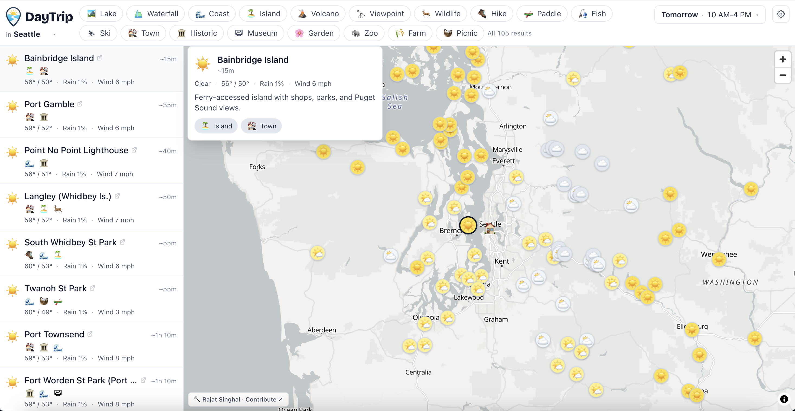
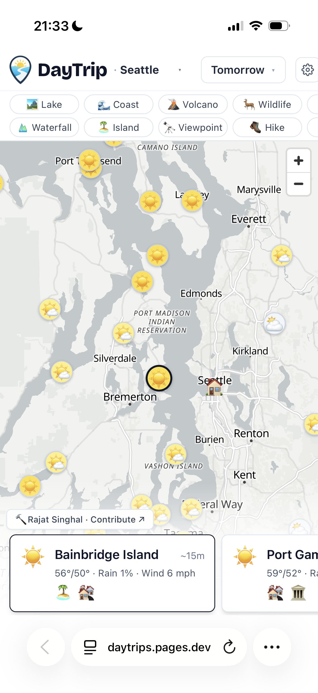
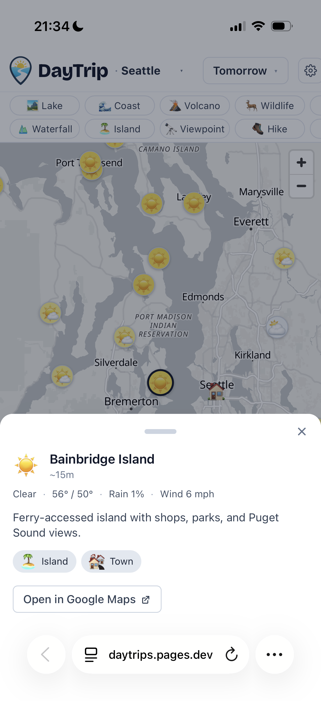
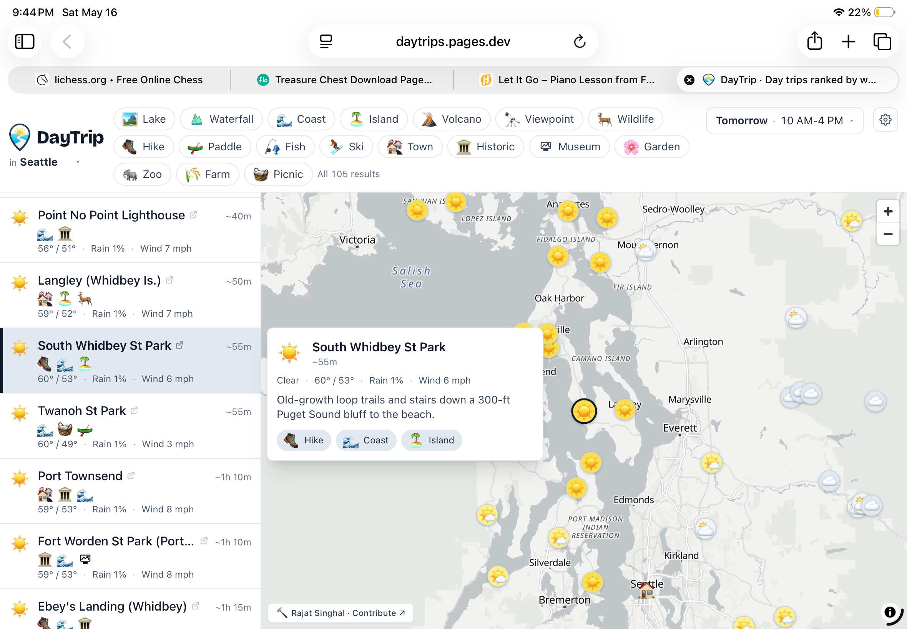

# Day Trip Planner

[](https://github.com/rajatsinghal/day-trip-planner/stargazers)
[](https://github.com/rajatsinghal/day-trip-planner/graphs/contributors)
[](./LICENSE)

You wake up Saturday with the day free and the same thought as every other weekend: *I should get out of the city.* But then come the tabs — weather app, hiking blog, that scenic-drive listicle you bookmarked in March — and an hour later you're still on the couch. DayTrip is the shortcut: 30+ curated day trips around your metro, ranked by what the weather will actually be doing during the hours you'd be out there.

Pick a metro. The app figures out which days are worth planning — today if there's still time, tomorrow, and the coming weekend if it's a weekday. Set your trip window. Every destination is scored against NWS hourly forecasts for exactly those hours, then ranked. The answer to "where should I go?" is whatever's at the top.

**[daytrips.pages.dev](https://daytrips.pages.dev)**



**iPhone**

<p>
  
  &nbsp;&nbsp;
  
</p>

**iPad**



## Hubs

Seven metros covered today:

| Hub | Destinations |
|---|---|
| Seattle | Mountains, islands, waterfalls, wine country |
| Bay Area | Coast, redwoods, wine country, Sierra Nevada |
| Los Angeles | Beaches, desert, mountains, Channel Islands |
| Denver | Rockies, hot springs, ski areas, canyon country |
| Austin | Hill Country, state parks, rivers, BBQ towns |
| NYC | Hudson Valley, Catskills, Jersey Shore, Long Island |
| Boston | Cape Cod, White Mountains, Maine coast, Rhode Island |

Adding a new hub is a one-shot agent task — see [Add your area](#add-your-area) below.

## Built around the decision

Every part of DayTrip is designed to answer one question: where should I go, right now, for the day? Nothing is here for feature completeness — each piece closes the gap between "I wonder if the weather looks okay" and "I know where I'm going."

- **Time-aware day chips.** The app knows what's still worth planning. It's 1 PM? Today's trip window starts at 1 PM, not 10. It's 9 PM on a Thursday? Tomorrow leads, and the weekend shows too — because that's likely what you're actually planning. On a weekday you see up to four options (Today, Tomorrow, Saturday, Sunday); on a weekend, two.

- **Weather scored for your trip window, not the full day.** You set the hours you'll actually be out (e.g. 10 AM–4 PM). The app fetches NWS hourly forecasts and considers only those hours. One rainy hour in your window shows as rain — bad weather is never buried by sunny hours outside your window. But five sunny hours and one cloudy one reads as mostly sunny, not cloudy. Temperature comfort and peak wind during those hours factor into the final score too. It's a fundamentally different signal from the daily icon on Google Maps or a 24-hour high/low.

- **All destinations ranked simultaneously.** Every destination in the hub is scored and sorted best-weather-first for your chosen day and window. You don't open five browser tabs and compare manually — the comparison happens for you.

- **Curated for day trips, not scraped off a map.** Every destination was selected because people actually drive to it for a day: a named waterfall, a coastal town, a summit with a view. No restaurants, no neighborhoods, no generic "things to do" filler.

- **18 activity filters.** Hike, paddle, coast, wildlife, ski, waterfall, farm, and more. Toggle to narrow the list to what you're actually in the mood for before committing.

- **Interactive map.** MapLibre map with weather-color-coded pins. Click a pin or list row — the other side follows.

- **Responsive on every device.** Phone: full-screen map, swipeable card strip at the bottom, tap-to-detail sheet. Tablet: two-pane list + map. Desktop: side list with hover popovers.

- **Google Maps deep-link per destination.** One tap for directions, photos, and reviews.

- **Shareable URLs.** Hub and active filters sync to the URL — send a pre-filtered view to a friend.

- **°C / °F toggle.** Swaps wind units too.

- **No account, no API key, no backend.** Weather from the US National Weather Service — free, keyless, CORS-enabled. Static build, nothing to sign up for.

## Add your area

The destination list is split into **hubs**, one per metro area. Adding yours is a one-shot agent task.

[`AGENTS.md`](./AGENTS.md) is a detailed structured prompt written so any AI coding agent — Claude, Codex, Cursor, Grok, anything else — can complete the full contribution without hand-holding. The agent reads the file, does real web research for destinations, drafts `src/hubs/<your-area>.ts`, runs the validator until it passes, and opens a PR. You review and merge.

> Point your agent at this repo and say: *"Add a hub for {your area}."*

One constraint: hubs must be in the **continental US** — the weather source ([api.weather.gov](https://www.weather.gov/documentation/services-web-api)) is US-only. `AGENTS.md` §2 spells this out for the agent.

The full contributor flow is in [`CONTRIBUTING.md`](./CONTRIBUTING.md).

## Stack

- Vite + React + TypeScript + Tailwind
- [MapLibre GL](https://maplibre.org/) + free vector tiles from [OpenFreeMap](https://openfreemap.org/)
- [US National Weather Service](https://www.weather.gov/documentation/services-web-api) for forecasts (no API key, CORS-enabled, free)
- Static build — no backend, no auth, no database
- Hosted on [Cloudflare Pages](https://pages.cloudflare.com/)

## Run locally

```bash
npm install
npm run dev
```

Other useful scripts:

```bash
npm run typecheck             # tsc -b --noEmit
npm run validate-hub seattle  # validate a hub file (used by the agent loop)
npm run build                 # production build into dist/
```

To test on a phone on the same network, run with `--host`:

```bash
npm run dev -- --host
```

Vite will print the local network URL to open on your device.

## Deploy

Hosted on Cloudflare Pages. Any push to `main` triggers a deploy automatically.
PR previews are posted as comments on each pull request.

To self-host: push to GitHub, connect the repo in Cloudflare Pages, set build
command `npm run build` and output directory `dist`.

## License

MIT
